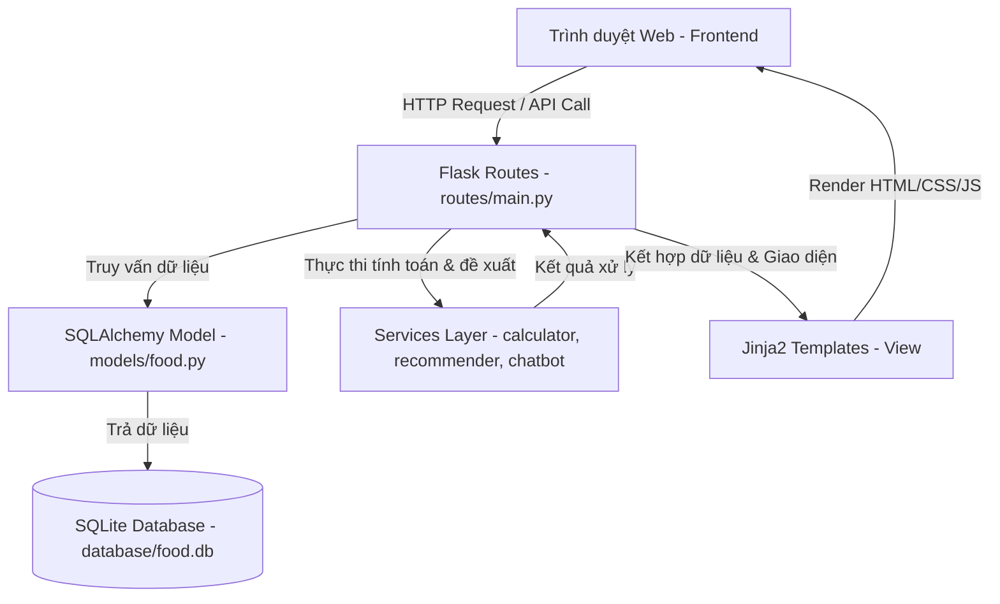

# Tài Liệu Kiến Trúc Hệ Thống (Architecture Documentation)
> **UTH Student Nutrition Meal Planner**

Tài liệu này mô tả chi tiết kiến trúc phần mềm, luồng dữ liệu và thuật toán cốt lõi của Hệ thống xây dựng thực đơn dinh dưỡng sinh viên UTH.

---

## 🏛️ Kiến Trúc Tổng Quan (MVC Pattern)

Dự án áp dụng mô hình kiến trúc **Model-View-Controller (MVC)** nhằm chia tách rõ ràng giữa cấu trúc dữ liệu, giao diện hiển thị và logic nghiệp vụ.

### 1. Model (Dữ liệu)
- Được định nghĩa tại [models/food.py](file:///Users/thien/Documents/learn/TDTKDMST/models/food.py) sử dụng Flask-SQLAlchemy.
- Ánh xạ trực tiếp tới bảng `foods` trong SQLite database.

### 2. View (Giao diện người dùng)
- Sử dụng công cụ Jinja2 template để render động các trang HTML tại thư mục `templates/`.
- Thiết kế Glassmorphism và tối ưu hóa CSS Vanilla tĩnh tại [static/css/main.css](file:///Users/thien/Documents/learn/TDTKDMST/static/css/main.css).
- Tương tác bất đồng bộ thông qua fetch API viết bằng Vanilla JavaScript tại [static/js/main.js](file:///Users/thien/Documents/learn/TDTKDMST/static/js/main.js) và [static/js/chat.js](file:///Users/thien/Documents/learn/TDTKDMST/static/js/chat.js).

### 3. Controller & Services (Xử lý logic)
- **Controller** ([routes/main.py](file:///Users/thien/Documents/learn/TDTKDMST/routes/main.py)): Định nghĩa các đường dẫn web và API endpoints, tiếp nhận các tham số đầu vào từ client, phân phối công việc cho các service tương ứng và trả về kết quả dưới dạng HTML hoặc JSON.
- **Service Layer**:
  - `services/calculator.py`: Chứa các hàm toán học tính toán BMI, BMR, TDEE.
  - `services/recommender.py`: Chứa thuật toán đề xuất thực đơn tối ưu hóa dinh dưỡng trong phạm vi ngân sách.
  - `services/chatbot.py`: Chứa bộ lọc biểu thức chính quy (Regex) phân tách tham số từ tin nhắn người dùng và tích hợp AI.

---

## 🧮 Công Thức Toán Học Cốt Lõi

### 1. Chỉ số khối cơ thể (BMI)
$$BMI = \frac{Weight_{kg}}{(Height_{m})^2}$$
*Phân loại:*
- BMI < 18.5: Gầy (Underweight)
- 18.5 <= BMI < 25.0: Bình thường (Normal)
- 25.0 <= BMI < 30.0: Thừa cân (Overweight)
- BMI >= 30.0: Béo phì (Obese)

### 2. Tỷ lệ trao đổi chất cơ bản (BMR) - Mifflin-St Jeor
- **Nam (Male)**:
  $$BMR = 10 \times Weight_{kg} + 6.25 \times Height_{cm} - 5 \times Age_{years} + 5$$
- **Nữ (Female)**:
  $$BMR = 10 \times Weight_{kg} + 6.25 \times Height_{cm} - 5 \times Age_{years} - 161$$

### 3. Tổng năng lượng tiêu thụ hàng ngày (TDEE)
$$TDEE = BMR \times Activity\_Factor$$
*Hệ số vận động (Activity Factor):*
- Ít vận động (sedentary): 1.2
- Vận động nhẹ (lightly active): 1.375
- Vận động vừa (moderately active): 1.55
- Vận động nhiều (very active): 1.725
- Vận động cực nhiều (extra active): 1.9

---

## 🍽️ Thuật Toán Đề Xuất Thực Đơn (Recommendation Algorithm)

Thuật toán đề xuất thực đơn sử dụng phương pháp **Tìm kiếm tối ưu ngẫu nhiên có ràng buộc (Randomized Constraint-Satisfaction Search)**:

1. **Phân nhóm dữ liệu**: Lọc các món ăn trong Database thành 3 nhóm lớn:
   - *Bữa sáng (Sáng)*
   - *Bữa chính (Trưa/Tối)*
   - *Bữa phụ / Đồ uống (Ăn vặt / Nước uống)*
2. **Tìm kiếm tổ hợp**: Thực hiện lặp lại tối đa 3,000 lần:
   - Chọn ngẫu nhiên 1 món ăn sáng ($B$).
   - Chọn ngẫu nhiên 2 món ăn chính khác nhau cho Bữa trưa ($L$) và Bữa tối ($D$).
   - Chọn ngẫu nhiên 1 món ăn phụ hoặc đồ uống ($S$).
   - Tính tổng các chỉ số:
     - $Cost = Cost(B) + Cost(L) + Cost(D) + Cost(S)$
     - $Cal = Cal(B) + Cal(L) + Cal(D) + Cal(S)$
     - $Prot = Prot(B) + Prot(L) + Prot(D) + Prot(S)$
     - $Fib = Fib(B) + Fib(L) + Fib(D) + Fib(S)$
3. **Đánh giá điểm số (Scoring Function)**:
   - Nếu $Cost \le Ngân\_sách\_mục\_tiêu$:
     - Tính độ lệch calo: $Cal\_Diff = |Cal - Cal\_Target|$
     - Điểm số: $Score = (Prot \times 5.0) + (Fib \times 2.0) - (Cal\_Diff \times 1.5)$
     - Nếu $Cal\_Diff / Cal\_Target \le 0.20$, thưởng thêm 200 điểm.
     - Lưu lại tổ hợp có điểm số cao nhất.
4. **Cơ chế Fallback (Bảo vệ)**:
   - Nếu trong 3,000 lần thử không tìm được tổ hợp nào có tổng chi phí nhỏ hơn hoặc bằng ngân sách: Hệ thống sẽ tự động sắp xếp các món ăn theo giá tăng dần và chọn ra tổ hợp món ăn rẻ nhất của mỗi bữa ăn để làm thực đơn "siêu tiết kiệm", đồng thời đưa ra cảnh báo cho sinh viên.
