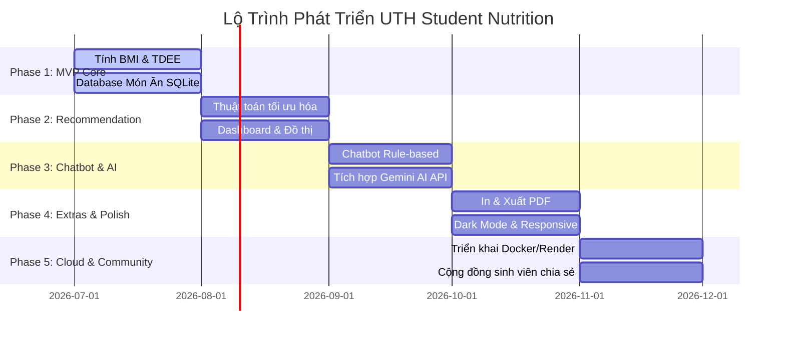

# Lộ Trình Phát Triển Dự Án (Product Roadmap)
> **UTH Student Nutrition Meal Planner**

Tài liệu này vạch ra các giai đoạn phát triển của hệ thống xây dựng thực đơn dinh dưỡng cho sinh viên UTH từ phiên bản khởi đầu tới các tính năng mở rộng trong tương lai.

---

## 📍 Tóm Tắt Các Giai Đoạn

---

## 📑 Chi Tiết Từng Giai Đoạn

### Giai Đoạn 1: Xây Dựng Nền Tảng (Phase 1 - MVP Core)
*Mục tiêu: Đảm bảo các tính toán sức khỏe cơ bản hoạt động chính xác.*
- [x] Tạo cấu trúc thư mục chuẩn Flask MVC.
- [x] Triển khai logic tính toán BMI, BMR, TDEE tại [services/calculator.py](file:///Users/thien/Documents/learn/TDTKDMST/services/calculator.py).
- [x] Tạo cơ sở dữ liệu SQLite chứa danh mục món ăn ban đầu.
- [x] Nạp dữ liệu mẫu (Seeding) hơn 100 món ăn Việt Nam quen thuộc.

### Giai Đoạn 2: Bộ Máy Đề Xuất (Phase 2 - Smart Recommendation)
*Mục tiêu: Đưa ra thực đơn thông minh theo ngân sách.*
- [x] Hoàn thiện thuật toán tìm kiếm ngẫu nhiên có ràng buộc chi phí và calo tại [services/recommender.py](file:///Users/thien/Documents/learn/TDTKDMST/services/recommender.py).
- [x] Tích hợp Chart.js để vẽ biểu đồ tròn (Macro dinh dưỡng) và biểu đồ cột (Calo/Chi phí).
- [x] Thiết kế giao diện Dashboard hiển thị thực đơn theo dạng thẻ (Card) trực quan.
- [x] Thêm bộ lọc và tìm kiếm món ăn trực tiếp từ database.

### Giai Đoạn 3: Trợ Lý Ảo (Phase 3 - Chatbot & AI Integration)
*Mục tiêu: Tương tác tự nhiên thông qua chat.*
- [x] Xây dựng widget chat bong bóng góc phải và trang chat riêng biệt.
- [x] Thiết lập bộ phân tích Regex tự động trích xuất chỉ số (chiều cao, cân nặng, tuổi, giới tính, tiền ăn) trong tin nhắn chat.
- [x] Viết API tích hợp Gemini API/OpenAI API, tự động fallback về rule-based nếu thiếu API Key.
- [x] Lưu trữ trạng thái thông số người dùng trong Session để tư vấn liền mạch.

### Giai Đoạn 4: Tiện Ích & Trải Nghiệm (Phase 4 - UX & Export Utilities)
*Mục tiêu: Tối ưu hóa giao diện và tăng tính tiện dụng.*
- [x] Triển khai tính năng Export PDF/Print và tải file thực đơn CSV.
- [x] Cài đặt hiệu ứng tải trang (Loading animation) và thông báo nhanh (Toast notification).
- [x] Thiết kế Dark Mode/Light Mode lưu giữ tùy chọn qua LocalStorage.
- [x] Thiết kế Responsive chạy mượt mà trên điện thoại di động của sinh viên.

### Giai Đoạn 5: Đưa Lên Cloud & Mở Rộng (Phase 5 - Deployment & Beyond)
*Mục tiêu: Đưa ứng dụng tới tay cộng đồng sinh viên UTH.*
- [ ] Docker hóa toàn bộ ứng dụng (Dockerfile & docker-compose.yml).
- [ ] Triển khai ứng dụng lên các nền tảng miễn phí/giá rẻ (Render, Railway, PythonAnywhere).
- [ ] Tích hợp tính năng cho phép sinh viên đăng nhập và tự thêm các món ăn yêu thích, hoặc đánh giá món ăn tại căn-tin trường UTH.
